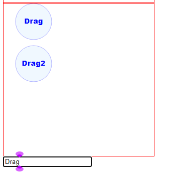

# The Project

This tiny Angular project is to test dragging in an SVG-templated component.

Those who use Angular have all the incentives to use Angular Material,
which now has it [own drag class](https://material.angular.io/cdk/drag-drop/overview)  
in the CDK, which works great for HTML DOM components, especially reordering lists.  

However cdkDrag is not implemented for SVG well. 
According to [this stackoverflow item](https://stackoverflow.com/questions/67297846/drag-and-drop-an-svg-element-works-with-angular-7-but-not-with-angular-11) 
CDK drag used to work for Angular 7 but not for Angular 11. 

So for SVG based components, what are the options? 
I can see 3 possibilities

1. The plain-draggable library. This is my choice, and this is what this test project is about
2. manually implementing dragging with mouseDown etc.
3. Using heavy and sometimes non-free 3rd party libraries like d3 or green sock


# Notes

1. Good start for reading would be [plain-draggable issues/96](https://github.com/anseki/plain-draggable/issues/96)
2. [Working simple example](https://stackblitz.com/edit/angular-ivy-mkm3q8) by the author of plain-draggble is a good place to start.
3. Use `declare let PlainDraggable: any;` instead of `import PlainDraggable from 'plain-draggable';`
I wish there were `@types/plain-draggable` typings, and Angular module but there isn't
4. Add plain-draggable to `angular.json/.../scripts`. See [issue 100](https://github.com/anseki/plain-draggable/issues/100) or [StackOverflow cover](https://stackoverflow.com/questions/68925686/import-3rd-party-js-lib-into-angular-12-library)
```JSON
"scripts": [
              {
                "input": "node_modules/plain-draggable/plain-draggable.min.js",
                "inject": true,
                "bundleName": "plain-draggable"
              }
            ]
```

5. I had a [problem with multiple handles after change detection](https://github.com/anseki/plain-draggable/issues/112). 
The library owner helped me resolve it. You are welcome to read the description on github, but TLDR, it works now. 
Check out the compoinent `drag-us`. It shows multiple handles, and the way it updates PlainDraggable wrapper. 
To test it, just change the text of the label that appears beneath all the components.
In summary what makes the trick is `setTimeout` coupled with seprateing @Input into a getter and setter. The getter calls initialization of the draggables on change. 


