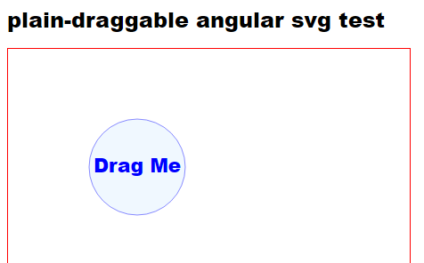

# The Project

This tiny Angular project is to test dragging in an SVG-templated component.
Unlike HTML, cdkDrag is not implemented for SVG. 

A library I found is plain-draggable, and this project is a test of its SVG+Angular dragging ability.



# Notes

1. Good start for reading would be [plain-draggable issues/96](https://github.com/anseki/plain-draggable/issues/96)
2. [Working simple example](https://stackblitz.com/edit/angular-ivy-mkm3q8) by the author of plain-draggble is a good place to start.
3. Use `declare let PlainDraggable: any;` instead of `import PlainDraggable from 'plain-draggable';`
I wish there were `@types/plain-draggable` typings, and Angular module but there isn't
4. Add plain-draggable to `angular.json/.../scripts`. See [issue 100](https://github.com/anseki/plain-draggable/issues/100) or [StackOverflow cover](https://stackoverflow.com/questions/68925686/import-3rd-party-js-lib-into-angular-12-library)
```JSON
"scripts": [
              {
                "input": "node_modules/plain-draggable/plain-draggable.min.js",
                "inject": true,
                "bundleName": "plain-draggable"
              }
            ]
```

# Problem with multiple handles after change detection

I have submitted this issue to https://github.com/anseki/plain-draggable/issues/112

## The issue
I have made a test with Angular, SVG and draggable handle. I have made a separate component out of SVG, and it all works nicely. I summed up all the issues other people discussed regarding Angular, SVG etc in the readme.md

However here is the problem I am not sure how to solve.
I want multiple draggable handles in a component. So I use *ngFor and ng-container to generate the code
```HTML    
<ng-container     *ngFor="let t of texts; let i=index"  
       <g  #draggables [attr.transform]="'translate(200,' + 400*i + ')'">     <circle...
```
Accordingly, in the ts @ViewChildren is used
```Typescript
  @ViewChildren('draggables')
  public handles: QueryList<ElementRef> | undefined;
...
        for (let i = 0; i < handles.length; i++) {
          const draggable = new PlainDraggable(handles[i].nativeElement);
        }
```
This works ok, until a bound property changes and the component gets redrawn. Dragging stops.

Full project illustrating the issue is in the public github project.
https://github.com/michaelkariv/plain-draggable-angular-svg-test

To make dragging stop, just change the text of the label that appears beneath all the components.
